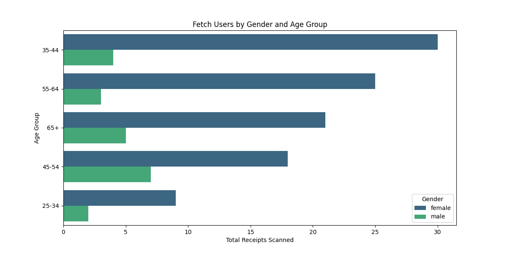
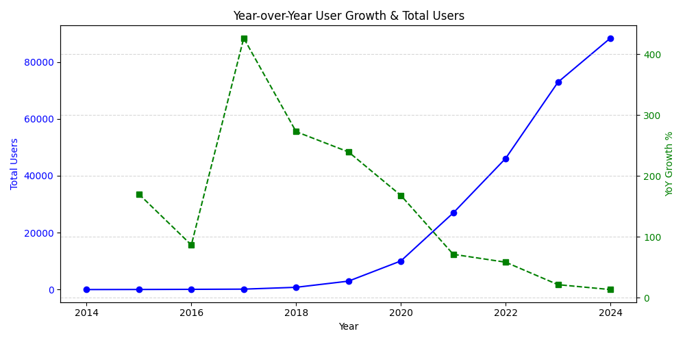

# Fetch Data Analyst Take-Home Assignment

## 1. Data Exploration

The provided dataset consists of three CSV files:

- **transactions.csv** (Receipt-level purchase data)
- **users.csv** (User demographic and account details)
- **products.csv** (Product metadata)

## Data Quality Issues

### Users Data

- `birth_date` is missing for 3,675 users, making age-based analysis incomplete.
- `state`, `language`, and `gender` have substantial missing values, impacting segmentation.
- `language` has only two unique values (`en`, `es-419`), which seems limited.
- Inconsistent values in the `gender` column, requiring standardization.
- Some users have an age over 120, which seems implausible and may be due to placeholder or incorrect data.
- Only 91 users from the users table match userids from the transaction table. This makes querying user info from transactions very difficult.


### Products Data

- There were fully duplicate records which I removed.
- `CATEGORY_4` is missing for 774,109 products, limiting product classification depth.
- `MANUFACTURER` and `BRAND` have over 226,000 missing values, making brand-level analysis difficult.
#### Placeholder values found in manufacturer and brand fields:
- "PLACEHOLDER MANUFACTURER" in the `manufacturer` column.
- "BRAND NOT KNOWN" and "BRAND NEEDS REVIEW" in the `brand` column.
- This suggests data gaps or incomplete ingestion, making it difficult to analyze brand-level sales.
#### Duplicate barcodes exist, but associated product details differ (e.g., different brands/manufacturers).
- I removed these as well. Records where one of the dupes had NULL or placeholder data for the manufacturer or brand were removed first
- Records where one of the dupes had fewer categories were removed second.
- For the rest I used a combination of judgement and common sense, I wanted no duplicate barcodes so I took some initiative here in removing records.  All else being equal I would pick the record with more common manufacturer/brand/category names.


### Transactions Data

During the initial exploration, we identified several data quality issues:

- Exactly half the records seemed to be bad.  Each item on each receipt was duplicated with 1 record having what looked like good data and 1 record having what looked like bad data.
  - The bad data was the word 'zero' in the final_quantity column OR a blank space ' ' in the final_sale column.
  - I couldn't see any use for these records so I removed them.  This is the main thing I would put in the "Are there any fields that are challenging to understand?" category and would want clarification.  It seems to me like an error with the way records are being created / receipts were being ingested in the first place.
- 2,856 NULL barcodes, affecting product mapping.
- 4,465 distinct barcodes in the transaction table that have no match in the products table.


## Fields That Are Challenging to Understand

### `FINAL_QUANTITY` in Transactions

- Some values are "zero", which could indicate returns, voided items, or bad data.
- Needs clarification from Fetch on whether these should be excluded.

### `SCAN_DATE` vs. `PURCHASE_DATE`

- `SCAN_DATE` is sometimes after `PURCHASE_DATE`, implying manual receipt submission rather than real-time scanning.
- This affects time-based analyses (e.g., user activity trends).

### `barcode` Inconsistencies

- The same barcode appears with different brands/manufacturers in `products.csv`, making brand mapping unreliable.


## SQL Queries

I know the instructions said to answer 3 questions but I answered all of them.

### What are the top 5 brands by receipts scanned among users 21 and over?

DOVE
NERDS CANDY
TRIDENT
GREAT VALUE
MEIJER

```sql
SELECT p.brand
FROM transactions t
JOIN users u ON t.user_id = u.id
JOIN products p ON t.barcode = p.barcode
WHERE p.brand IS NOT NULL and u.birth_date <= CURRENT_DATE - INTERVAL '21 years'
GROUP BY p.brand
ORDER BY COUNT(DISTINCT t.receipt_id) DESC, SUM(t.quantity * t.sale) desc
LIMIT 5
```

I used `SUM(t.quantity * t.sale)` as a tie breaker to limit the answer to 5 brands.

### What are the top 5 brands by sales among users that have had their account for at least six months?

CVS
DOVE
TRESEMMÉ
TRIDENT
COORS LIGHT

Basically the same query, changing birth_date to created_date with a different interval and sorting only by `SUM(t.quantity * t.sale)`

```sql
SELECT p.brand
FROM transactions t
JOIN users u ON t.user_id = u.id
JOIN products p ON t.barcode = p.barcode
WHERE p.brand IS NOT NULL and u.created_date <= CURRENT_DATE - INTERVAL '6 months'
GROUP BY p.brand
ORDER BY SUM(t.quantity * t.sale) desc
```


### What is the percentage of sales in the Health & Wellness category by generation?

Assumption: by generation we mean the noun and are using it to section users by age, ie Gen X, Millenials, etc.  If we meant it as a verb and want to see the percentage of total sales **generated** by category, it would be a different query.

Using generation dates from here: https://www.pewresearch.org/short-reads/2019/01/17/where-millennials-end-and-generation-z-begins/

This one was extra tough because of the previously mentioned data quality issues connecting the tables.

| Generation | Health & Wellness Sales | Total Sales | Percentage of Sales |
|-|-|-|-|
| Gen Z | | 1.9700 | |
| Silent Generation | | 6.7100 | |
| Boomers | 86.5600 | 230.4100 | 37.57 |
| Gen X | 52.3900 | 198.8300 | 26.35 |
| Millennials | 35.1700| 198.6200 | 17.71 |


```sql
WITH user_generations AS (
    SELECT id, 
           CASE 
               WHEN birth_date >= '2012-01-01' THEN 'Gen Alpha'
               WHEN birth_date BETWEEN '1997-01-01' AND '2011-12-31' THEN 'Gen Z'
               WHEN birth_date BETWEEN '1981-01-01' AND '1996-12-31' THEN 'Millennials'
               WHEN birth_date BETWEEN '1965-01-01' AND '1980-12-31' THEN 'Gen X'
               WHEN birth_date BETWEEN '1946-01-01' AND '1964-12-31' THEN 'Boomers'
               ELSE 'Silent Generation'
           END AS generation
    FROM users
    WHERE birth_date IS NOT NULL
),
category_sales AS (
    SELECT u.generation,
           SUM(t.quantity * t.sale) AS health_wellness_sales
    FROM transactions t
    JOIN user_generations u ON t.user_id = u.id
    JOIN products p ON t.barcode = p.barcode
    WHERE p.category_1 = 'Health & Wellness'
    GROUP BY u.generation
),
total_sales AS (
    SELECT u.generation,
           SUM(t.quantity * t.sale) AS total_sales
    FROM transactions t
    JOIN user_generations u ON t.user_id = u.id
    GROUP BY u.generation
)
SELECT ts.generation,
       cs.health_wellness_sales,
       ts.total_sales,
       ROUND((cs.health_wellness_sales * 100.0) / NULLIF(ts.total_sales, 0), 2) AS percentage_of_sales
FROM total_sales ts
LEFT JOIN category_sales cs ON ts.generation = cs.generation
ORDER BY percentage_of_sales DESC;
```


### Who are Fetch’s power users?

Assumption: we want some kind of marketable demographic data and not a list of the top 5 userids by spending, or something like that.  

Women age 35-44.




```sql
WITH user_activity AS (
    SELECT user_id, 
           COUNT(DISTINCT receipt_id) AS total_receipts,
           SUM(quantity * sale) AS total_spent
    FROM transactions
    GROUP BY user_id
),
user_details AS (
    SELECT id, 
           gender, 
           EXTRACT(YEAR FROM AGE(CURRENT_DATE, birth_date)) AS age
    FROM users
    WHERE birth_date IS NOT NULL
)
SELECT 
    CASE 
        WHEN ud.age < 18 THEN 'Under 18'
        WHEN ud.age BETWEEN 18 AND 24 THEN '18-24'
        WHEN ud.age BETWEEN 25 AND 34 THEN '25-34'
        WHEN ud.age BETWEEN 35 AND 44 THEN '35-44'
        WHEN ud.age BETWEEN 45 AND 54 THEN '45-54'
        WHEN ud.age BETWEEN 55 AND 64 THEN '55-64'
        ELSE '65+' 
    END AS age_group,
    ud.gender,
    COUNT(DISTINCT ua.user_id) AS user_count,
    SUM(ua.total_receipts) AS total_receipts,
    SUM(ua.total_spent) AS total_spent
FROM user_activity ua
JOIN user_details ud ON ua.user_id = ud.id
GROUP BY age_group, ud.gender
ORDER BY total_receipts DESC;
```


### Which is the leading brand in the Dips & Salsa category?

Tostitos

```sql
SELECT p.brand, 
       SUM(t.quantity * t.sale) AS total_sales,
       COUNT(DISTINCT t.receipt_id) AS receipts_scanned
FROM transactions t
JOIN products p ON t.barcode = p.barcode
WHERE p.category_2 = 'Dips & Salsa'
GROUP BY p.brand
ORDER BY total_sales DESC;
```

### At what percent has Fetch grown year over year?

We are lacking transaction data across years which was my first impulse, so I used the number of users.

YoY growth by users for 2024 was %13.16



While YoY growth is down, the main reason is because the userbase keeps getting bigger!

```sql
WITH yearly_users AS (
    SELECT EXTRACT(YEAR FROM created_date) AS year,
           COUNT(id) AS new_users
    FROM users
    GROUP BY year
),
cumulative_users AS (
    SELECT year, 
           new_users,
           SUM(new_users) OVER (ORDER BY year ROWS BETWEEN UNBOUNDED PRECEDING AND 1 PRECEDING) AS total_users_prior
    FROM yearly_users
)
SELECT year,
       new_users,
       COALESCE(total_users_prior, 0) AS total_users_prior,
       ROUND(
           (new_users * 100.0) / NULLIF(total_users_prior, 0), 2
       ) AS yoy_growth_percentage
FROM cumulative_users
ORDER BY year DESC;
```


python -m venv fetch_env

source fetch_env/bin/activate

python3 -m pip install -r requirements.txt

python3 power_users.py

streamlit run salsa.py


